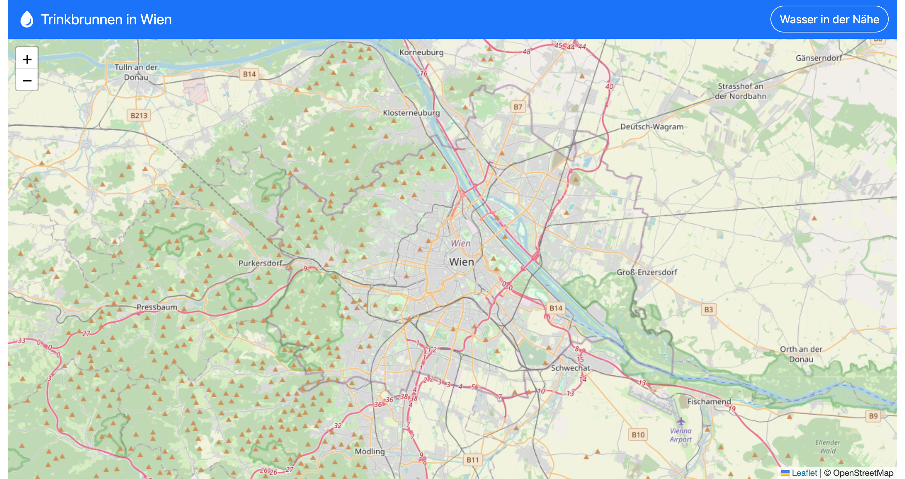

# Trinkbrunnen

## Beschreibung

Dies ist eine Single-Page Application (SPA), die dazu dient, alle verfügbaren Trinkbrunnen in der Umgebung (Umkreis 1 km Luftlinie) anzuzeigen. Die Anwendung nutzt eine responsive Fullscreen-Oberfläche und integriert eine Leaflet-OpenStreetMap-Karte sowie die Geolocation-API, um die Position des Benutzers zu bestimmen.

## Funktionen

### Responsive Fullscreen

Die Anwendung bietet eine responsive Fullscreen-Oberfläche, die sich an verschiedene Bildschirmgrößen anpasst und eine optimale Benutzererfahrung auf allen Geräten gewährleistet.

### Leaflet-OpenStreetMap-Karte

Die Anwendung verwendet die Leaflet-Bibliothek in Kombination mit OpenStreetMap, um eine interaktive Karte bereitzustellen. Auf dieser Karte werden alle verfügbaren Trinkbrunnen in der Umgebung angezeigt.

### Geolocation-API

Die Anwendung nutzt die Geolocation-API, um die aktuelle Position des Benutzers zu bestimmen.

### Popups mit Beschreibungen

Jedes Trinkbrunnen-Icon (Marker) auf der Karte zeigt bei einem Klick ein Popup an, das eine Beschreibung des Trinkbrunnens enthält.

### Technologien

- HTML, CSS, JavaScript für die Frontend-Entwicklung
- Leaflet für die Kartendarstellung
- OpenStreetMap als Kartendienst
- Geolocation-API für die Bestimmung der Benutzerposition

## Ausgabe
